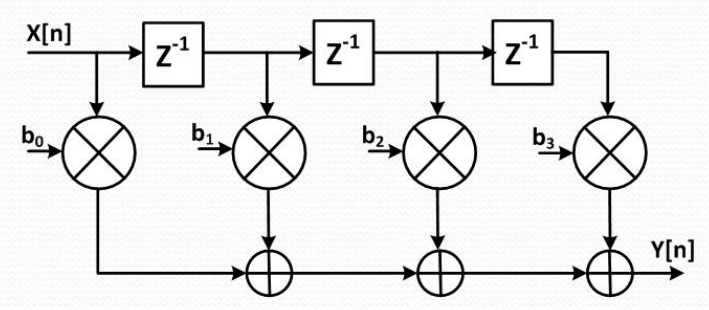
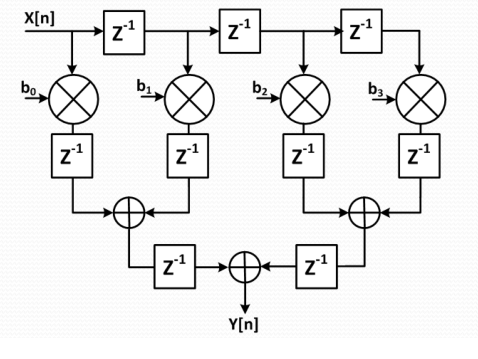

# 4-Tap FIR Filter Implementation in VHDL

## Overview

This directory contains a complete implementation of a **4-tap Finite Impulse Response (FIR) filter** using modular Z-domain components in VHDL. The filter implements the Direct Form I architecture and is designed for digital signal processing applications on FPGA platforms.

## What is a FIR Filter?

A **Finite Impulse Response (FIR)** filter is a type of digital filter that has a finite-duration impulse response. Unlike IIR (Infinite Impulse Response) filters, FIR filters:
- Are always stable
- Have linear phase response (when coefficients are symmetric)
- Have no feedback loops
- Process only current and past input samples

The mathematical equation for a 4-tap FIR filter is:
```
Y[n] = b₀×X[n] + b₁×X[n-1] + b₂×X[n-2] + b₃×X[n-3]
```

Where:
- `Y[n]` = current output sample
- `X[n]` = current input sample  
- `X[n-k]` = input sample k time steps ago
- `b₀, b₁, b₂, b₃` = filter coefficients (tap weights)


## Architecture Details

This implementation provides **two variants** of the 4-tap FIR filter:

1. **Direct Form** (`fir_filter_4tap.vhd`) - Minimal latency, lower maximum clock frequency
2. **Pipelined Form** (`fir_filter_4tap_pipelined.vhd`) - Higher latency, higher maximum clock frequency

### Block Diagrams

**Direct Form FIR Filter:**


**Pipelined Form FIR Filter:**


### Implementation Structure

The FIR filter is implemented using a **structural architecture** that instantiates modular Z-domain components:

#### 1. **Entity Declaration** (`fir_filter_4tap.vhd` lines 5-18)
```vhdl
entity fir_filter_4tap is
    generic (
        n : integer := 8;           -- Data width
        b0 : signed(7 downto 0) := X"20";  -- Coefficient 0
        b1 : signed(7 downto 0) := X"30";  -- Coefficient 1
        b2 : signed(7 downto 0) := X"20";  -- Coefficient 2
        b3 : signed(7 downto 0) := X"10"   -- Coefficient 3
    );
    port (
        clk : in std_logic;
        x   : in signed(n-1 downto 0);     -- Input X[n]
        y   : out signed(n-1 downto 0)     -- Output Y[n]
    );
end entity;
```

**Key Features:**
- **Configurable data width** (`n`): Default 8-bit, easily scalable
- **Parametric coefficients**: Easily modified via generics
- **Signed arithmetic**: Handles positive and negative values
- **Synchronous operation**: Uses clock for delay elements

#### 2. **Component Declarations** (lines 23-50)

The filter uses three types of Z-domain building blocks:

**`zdelay` - Delay Element (Z⁻¹)**
- Creates unit delays in the digital domain
- Equivalent to a D-flip flop or register
- Stores previous input samples

**`zgain` - Coefficient Multiplier** 
- Multiplies input by a coefficient
- Implements the tap weights (b₀, b₁, b₂, b₃)
- Handles signed multiplication with proper scaling

**`zsum` - Adder**
- Adds two signed numbers
- Used for summing weighted delayed samples
- Includes overflow handling

#### 3. **Internal Signal Organization** (lines 52-65)

The architecture uses well-organized internal signals:

```vhdl
-- Delay line signals
signal x_d1 : signed(n-1 downto 0);  -- X[n-1]
signal x_d2 : signed(n-1 downto 0);  -- X[n-2] 
signal x_d3 : signed(n-1 downto 0);  -- X[n-3]

-- Multiplier outputs
signal y0 : signed(n-1 downto 0);    -- b0 * X[n]
signal y1 : signed(n-1 downto 0);    -- b1 * X[n-1]
signal y2 : signed(n-1 downto 0);    -- b2 * X[n-2]
signal y3 : signed(n-1 downto 0);    -- b3 * X[n-3]

-- Intermediate sums
signal sum01 : signed(n-1 downto 0); -- y0 + y1
signal sum23 : signed(n-1 downto 0); -- y2 + y3
```

#### 4. **Component Instantiations** (lines 69-83)

**Delay Line Chain** (lines 70-72):
```vhdl
DELAY1 : zdelay generic map(n) port map(clk, x, x_d1);      -- X[n-1]
DELAY2 : zdelay generic map(n) port map(clk, x_d1, x_d2);   -- X[n-2] 
DELAY3 : zdelay generic map(n) port map(clk, x_d2, x_d3);   -- X[n-3]
```
- Creates a tapped delay line
- Each `zdelay` provides access to previous samples
- Cascaded to create X[n-1], X[n-2], X[n-3]

**Coefficient Multipliers** (lines 75-78):
```vhdl
MULT0 : zgain generic map(n, b0) port map(x, y0);       -- b0 * X[n]
MULT1 : zgain generic map(n, b1) port map(x_d1, y1);    -- b1 * X[n-1]
MULT2 : zgain generic map(n, b2) port map(x_d2, y2);    -- b2 * X[n-2]
MULT3 : zgain generic map(n, b3) port map(x_d3, y3);    -- b3 * X[n-3]
```
- Each multiplier applies a specific coefficient
- Operates on current and delayed input samples
- Produces weighted contributions to final output

**Summation Tree** (lines 81-83):
```vhdl
SUM_01 : zsum generic map(n) port map(y0, y1, sum01);     -- Partial sum
SUM_23 : zsum generic map(n) port map(y2, y3, sum23);     -- Partial sum  
SUM_FINAL : zsum generic map(n) port map(sum01, sum23, y); -- Final output
```
- Uses a tree structure for efficient summation
- Reduces propagation delay compared to cascaded addition
- Produces final filtered output Y[n]

## Pipelined vs Direct Form Comparison

### Performance Trade-offs

| Aspect | Direct Form | Pipelined Form |
|--------|-------------|---------------|
| **Latency** | 3-4 cycles (inherent filter delay) | 6-7 cycles (filter + pipeline delay) |
| **Throughput** | 1 sample/cycle @ lower fclk | 1 sample/cycle @ higher fclk |
| **Critical Path** | Multiplier + 2 Adders | Single Multiplier OR Single Adder |
| **Max Frequency** | ~100-150 MHz | ~200-300 MHz  |
| **Resources** | Minimal registers | +12 pipeline registers |
| **Power** | Lower (fewer registers) | Higher (more registers switching) |

### When to Use Each Implementation

**Use Direct Form When:**
- Latency is critical (real-time control systems)
- Resource usage must be minimized  
- Clock frequency requirements are modest (<150 MHz)
- Power consumption is a primary concern
- Simple design with minimal complexity

**Use Pipelined Form When:**
- High throughput is required (>200 MHz)
- Processing multiple data streams in parallel
- Part of a larger high-speed processing pipeline
- Clock frequency is the limiting factor
- Latency can be tolerated for better performance

### Pipeline Architecture Details

The pipelined implementation adds three pipeline stages:

#### **Pipeline Stage 1**: Multiplier Output Registers
```vhdl
-- After each coefficient multiplier
y0_reg <= b0 * X[n];     -- 1 cycle delay
y1_reg <= b1 * X[n-1];   -- 1 cycle delay  
y2_reg <= b2 * X[n-2];   -- 1 cycle delay
y3_reg <= b3 * X[n-3];   -- 1 cycle delay
```

#### **Pipeline Stage 2**: First Level Adder Registers  
```vhdl  
-- After first level of summation
sum01_reg <= y0_reg + y1_reg;  -- 1 cycle delay
sum23_reg <= y2_reg + y3_reg;  -- 1 cycle delay
```

#### **Pipeline Stage 3**: Final Output Register
```vhdl
-- After final summation  
y <= sum01_reg + sum23_reg;    -- 1 cycle delay
```

### Critical Path Analysis

**Direct Form Critical Path:**
```
Input → Multiplier → Adder → Adder → Output
Delay: Tmult + 2×Tadd + Tsetup ≈ 8-12 ns 
Max frequency ≈ 100 MHz
```

**Pipelined Critical Path:**  
```
Input → Multiplier → Pipeline Register
   OR
Pipeline Register → Adder → Pipeline Register  
Delay: max(Tmult, Tadd) + Tsetup ≈ 4-6 ns
Max frequency ≈ 200-250 MHz
```

## Default Coefficient Values

The default coefficients implement a **low-pass filter** with symmetric response:

| Coefficient | Hex Value | Decimal | Fraction | Normalized |
|-------------|-----------|---------|----------|------------|
| b₀          | 0x20      | 32      | 32/256   | 0.125      |
| b₁          | 0x30      | 48      | 48/256   | 0.1875     |
| b₂          | 0x20      | 32      | 32/256   | 0.125      |
| b₃          | 0x10      | 16      | 16/256   | 0.0625     |

**Total Gain:** 0.125 + 0.1875 + 0.125 + 0.0625 = **0.5** (6 dB attenuation)

These coefficients provide:
- **Low-pass characteristics**: Attenuates high-frequency noise
- **Symmetric response**: Linear phase (no phase distortion)
- **Unity-normalized**: Prevents excessive gain/attenuation

## Usage Instructions

### 1. **Direct Form - Basic Instantiation**
```vhdl
FIR_DIRECT : fir_filter_4tap
    generic map (
        n  => 8,          -- 8-bit data
        b0 => X"20",      -- Coefficients
        b1 => X"30", 
        b2 => X"20",
        b3 => X"10"
    )
    port map (
        clk => system_clock,
        x   => input_signal,
        y   => filtered_output
    );
```

### 2. **Pipelined Form - Basic Instantiation**
```vhdl
FIR_PIPELINED : fir_filter_4tap_pipelined
    generic map (
        n  => 8,          -- 8-bit data
        b0 => X"20",      -- Coefficients
        b1 => X"30", 
        b2 => X"20",
        b3 => X"10"
    )
    port map (
        clk => system_clock,
        rst => system_reset,  -- Additional reset signal
        x   => input_signal,
        y   => filtered_output -- 3 cycles additional latency
    );
```

### 3. **High-Speed Processing Pipeline**
```vhdl
-- High-frequency design using pipelined form
FIR_HIGHSPEED : fir_filter_4tap_pipelined
    generic map (
        n  => 12,         -- Wider data for better precision
        b0 => X"200",     -- Scaled coefficients for 12-bit
        b1 => X"300",
        b2 => X"200", 
        b3 => X"100"
    )
    port map (
        clk => high_speed_clock,  -- 250 MHz capable
        rst => system_reset,
        x   => adc_data,
        y   => filtered_data      -- Available 6 cycles later
    );
```

### 4. **Custom Coefficients - Both Forms**
```vhdl
-- High-pass filter coefficients
constant HP_B0 : signed(7 downto 0) := X"40";  -- +0.25
constant HP_B1 : signed(7 downto 0) := X"C0";  -- -0.25 
constant HP_B2 : signed(7 downto 0) := X"40";  -- +0.25
constant HP_B3 : signed(7 downto 0) := X"C0";  -- -0.25

-- Direct form high-pass filter
FIR_HP_DIRECT : fir_filter_4tap
    generic map (n => 8, b0 => HP_B0, b1 => HP_B1, b2 => HP_B2, b3 => HP_B3)
    port map (clk => clk, x => input_data, y => hp_out_direct);

-- Pipelined form high-pass filter  
FIR_HP_PIPELINED : fir_filter_4tap_pipelined
    generic map (n => 8, b0 => HP_B0, b1 => HP_B1, b2 => HP_B2, b3 => HP_B3)
    port map (clk => clk, rst => rst, x => input_data, y => hp_out_pipelined);
```

### 5. **Performance Comparison Setup**
```vhdl
-- Side-by-side comparison for verification
DIRECT_REF : fir_filter_4tap
    generic map (n => 8, b0 => X"20", b1 => X"30", b2 => X"20", b3 => X"10")
    port map (clk => clk, x => test_input, y => direct_output);

PIPELINED_DUT : fir_filter_4tap_pipelined  
    generic map (n => 8, b0 => X"20", b1 => X"30", b2 => X"20", b3 => X"10")
    port map (clk => clk, rst => rst, x => test_input, y => pipelined_output);

-- Note: pipelined_output will match direct_output delayed by 3 cycles
```


## Design Considerations

### 1. **Arithmetic Precision**
- Uses signed arithmetic for bipolar signals
- Default 8-bit width balances resource usage vs. precision
- Coefficients should be scaled to prevent overflow

### 2. **Latency and Timing**

**Direct Form:**
- **Combinatorial delay**: ~3 logic levels (multiply + 2 adds)
- **Pipeline stages**: 0 (purely combinatorial output)
- **Group delay**: 1.5 samples (typical for 4-tap symmetric FIR)
- **Total latency**: 3-4 cycles (inherent filter delay)

**Pipelined Form:**  
- **Combinatorial delay**: 1 logic level per stage
- **Pipeline stages**: 3 (multiplier → adder1 → adder2)
- **Additional latency**: +3 cycles beyond filter delay
- **Total latency**: 6-7 cycles
- **Advantage**: Supports 2-3× higher clock frequencies

### 3. **Resource Utilization**

**Direct Form:**
- **Registers**: 3 × n bits (delay line only)
- **Multipliers**: 4 × n-bit (DSP slices on FPGA)
- **Adders**: 3 × n-bit (logic resources)
- **Total registers**: ~24 bits (for n=8)

**Pipelined Form:**
- **Registers**: 15 × n bits (delay line + pipeline)
- **Multipliers**: 4 × n-bit (same as direct form)
- **Adders**: 3 × n-bit (same as direct form)  
- **Total registers**: ~120 bits (for n=8)
- **Reset logic**: Required for pipeline register initialization

### 4. **Frequency Response**
The default coefficients provide:
- **Passband**: DC to ~Fs/8 (where Fs = sampling frequency)
- **Transition band**: Fs/8 to Fs/4  
- **Stopband**: Fs/4 to Fs/2 (Nyquist frequency)
- **Attenuation**: ~6 dB in passband, increasing in stopband


### 1. **Filter Type Modification**
- **Low-pass**: Use positive, symmetric coefficients
- **High-pass**: Alternate signs [+, -, +, -]
- **Band-pass**: Design using windowing method
- **Band-stop**: Combine high-pass and low-pass

### 2. **Coefficient Design Methods**
- **Window method**: Apply Hamming, Blackman, etc. windows
- **Parks-McClellan**: Optimal equiripple design
- **Least-squares**: Minimize error over frequency range

### 3. **Performance Optimization**
- **Pipeline registers**: Add between multipliers and adders
- **Distributed arithmetic**: Replace multipliers with LUTs
- **Coefficient quantization**: Reduce coefficient word length

## Mathematical Background

### Z-Transform Representation
```
H(z) = b₀ + b₁×z⁻¹ + b₂×z⁻² + b₃×z⁻³
```

### Frequency Response
```
H(ω) = b₀ + b₁×e^(-jω) + b₂×e^(-j2ω) + b₃×e^(-j3ω)
```

Where ω is the normalized frequency (0 to π corresponds to 0 to Fs/2).

### Impulse Response
The filter's impulse response is simply the coefficient sequence:
```
h[n] = [b₀, b₁, b₂, b₃, 0, 0, ...]
```

This finite-length response gives FIR filters their name and inherent stability.


## References

1. **"Digital Signal Processing" by Proakis & Manolakis** - Chapter 7: FIR Filter Design
2. **"FPGA-based Implementation of Signal Processing Systems" by Kehtarnavaz** 
3. **"Digital Filters and Signal Processing" by Hamming**
4. **Xilinx Application Notes**: DSP design for FPGAs


